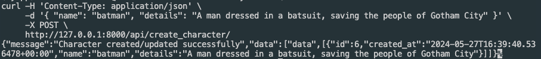

# StoryBook
A FastAPI Story Generator

This project is a FastAPI application that allows you to create characters and generate stories based on these characters using the OpenAI API.

## Features

- Create characters with specific details
- Generate stories for characters using OpenAI's GPT-3.5 model

## Requirements

- Python 3.7+
- FastAPI
- Uvicorn
- OpenAI Python client

## Installation

1. **Clone the repository:**

    ```bash
    git clone https://github.com/mhmmdrash/storybook.git
    cd storybook
    ```

2. **Create and activate a virtual environment:**

    ```bash
    python -m venv env
    source env/bin/activate  # On Windows use `env\Scripts\activate`
    ```

3. **Install the dependencies:**

    ```bash
    pip install -r requirements.txt
    ```

4. **Set up your OpenAI API key and Supabase credentials:**

    Rename .env.example to .env\
    Replace `"your-openai-key"` with your actual OpenAI API key\
    Replace `"your-supabase-key"` with your actual Supabase key\
    Replace `"your-supabase-url"` with your actual Supabase URL

## Usage

1. **Run the FastAPI application:**

    ```bash
    uvicorn main:app --reload
    ```

    The application will start and be accessible at `http://127.0.0.1:8000`.

2. **Create a character:**

    Use a tool like `curl`, Postman, or your browser to create a character:

    ```bash
    curl -X POST "http://127.0.0.1:8000/api/create_character/" -H "Content-Type: application/json" -d '{"name": "Batman", "details": "A man dressed in a batsuit, saving the people of Gotham City"}'
    ```

3. **Generate a story:**

    Use a tool like `curl`, Postman, or your browser to generate a story for a character:

    ```bash
    curl -X GET "http://127.0.0.1:8000/api/generate_story/1"
    ```

## Endpoints

- **Create Character**: `POST /api/create_character/`
  - Request Body:
    ```json
    {
      "name": "string",
      "details": "string"
    }
    ```
    
    

- **Generate Story**: `GET /api/generate_story/{character_id}`
  - Response:
    ```json
    {
      "message": "string",
    }
    ```

## License

This project is licensed under the MIT License. See the LICENSE file for more details.

## Acknowledgments

- [FastAPI](https://fastapi.tiangolo.com/)
- [OpenAI](https://www.openai.com/)
